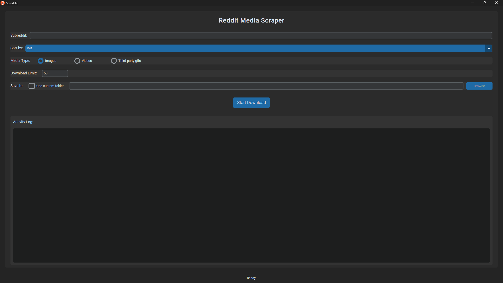

# Screddit

## About This Project

Screddit is a powerful, user-friendly Reddit media scraper designed to efficiently download images and videos from any subreddit. This standalone executable, built with Python, CustomTkinter, and PyInstaller, makes it simple to collect media content from Reddit without requiring any user authentication.

## Possible Uses

- **Creating Custom Datasets**: Build training datasets for machine learning and AI projects from specific subreddits
- **Wallpaper Collections**: Download high-quality images from wallpaper-focused communities
- **Meme Archives**: Create personal archives of memes from humor subreddits
- **Educational Resources**: Collect diagrams, infographics, and educational content for teaching materials

## Features
- Download images and videos from any subreddit
- Sort by hot, new, top, best, or rising
- Set download limits

## Download

You can download the latest version of Screddit from:

- [GitHub Releases](https://github.com/ajay-karmakar/screddit/releases) - Official releases

## How to Use

1. Launch the `Screddit.exe` application
2. Enter a subreddit name (without the "r/" prefix)
3. Select your sort preference (hot, new, top, best, rising)
4. Choose whether to download images, videos or third-party gifs
5. Set your download limit
6. By default, files will be saved in a folder named after the subreddit. You can toggle "Use custom folder" to select a specific location
7. Click "Start Download" to begin

## Interface

## Technical Details
This standalone executable includes all necessary dependencies. No installation required!

## Troubleshooting
- If the application fails to start, try running it with administrator privileges
- If downloads fail, check your internet connection and ensure the subreddit exists
- For any other issues, check the activity log for detailed error messages

## Legal Notice
This application is intended for legitimate personal use only. Users are responsible for ensuring their compliance with Reddit's Terms of Service and Content Policy. The developers of Screddit do not encourage or support downloading copyrighted material without proper authorization.
